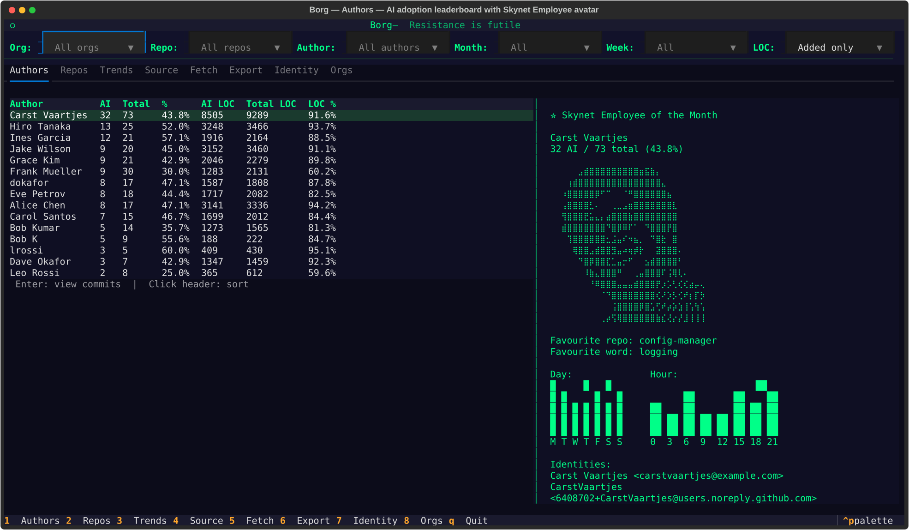
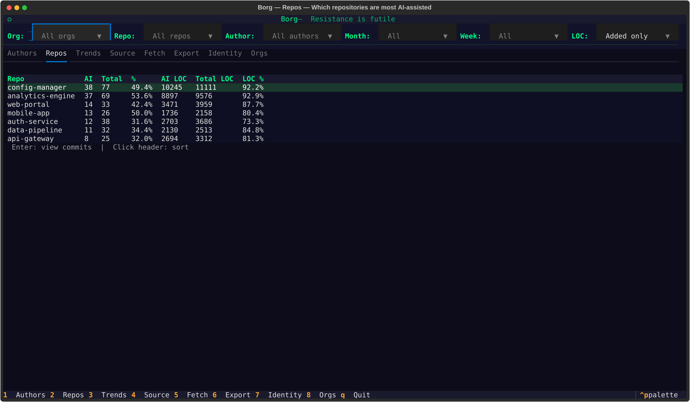
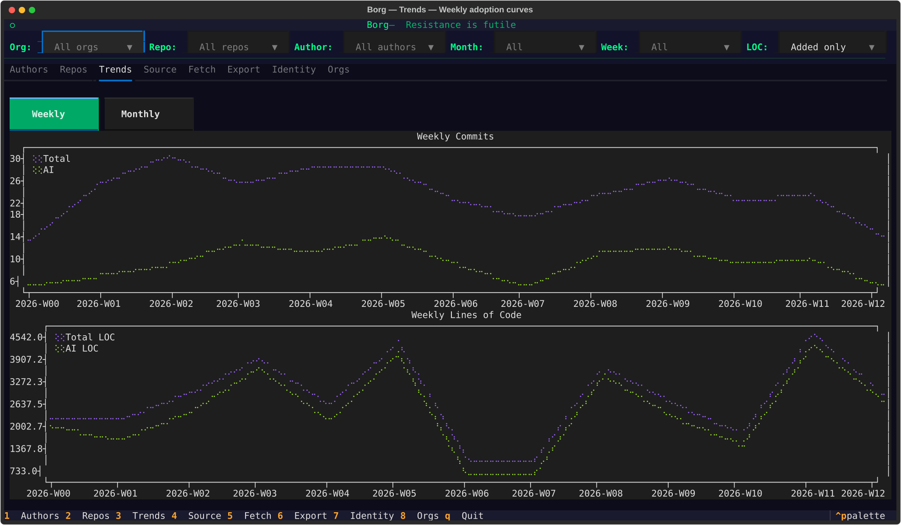
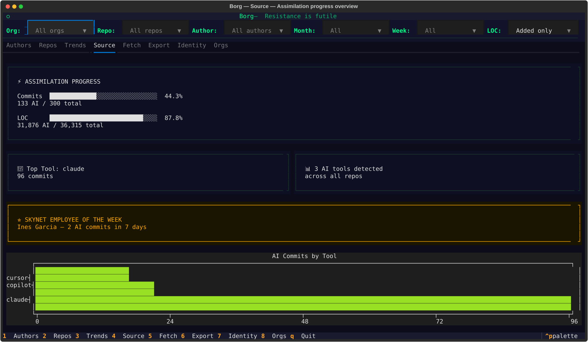
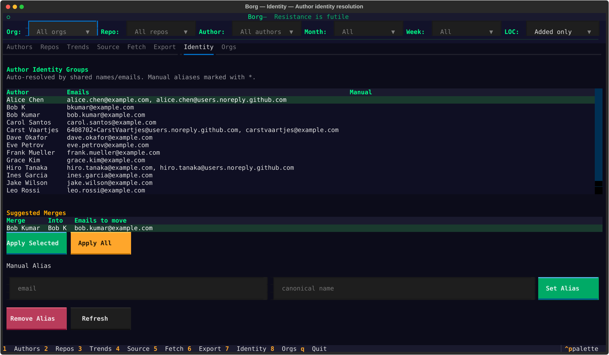

# Borg

> *"Resistance is futile."*

Your GitHub org is being assimilated by AI coding tools. Borg tracks how fast.

An interactive terminal dashboard that scans pull requests across your GitHub organizations, detects AI-assisted commits via `Co-Authored-By` trailers and message style heuristics, and shows you who's using what — with charts, rankings, and trends.

<p align="center">
  
</p>

## Quick Start

```bash
# Requires: Python 3.11+, uv, gh (authenticated)
git clone https://github.com/CarstVaartjes/borg.git && cd borg
uv sync
uv run borg
```

That's it. Everything happens in the TUI:

1. **Orgs** tab → add your GitHub org
2. **Fetch** tab → pull commit data from all PRs + run detection
3. **Authors** → see who's been assimilated

### Try with Demo Data

Want to explore without connecting to GitHub? A pre-built anonymized database is included:

```bash
cp demo/demo.db data/tracker.db
uv run borg
```

300 synthetic commits, 2 orgs, 7 repos, 12 authors (with duplicate identities for testing the Identity tab). No GitHub token needed.

## What You Get

### Who's using AI the most?

The **Authors** tab ranks everyone by AI commits, total commits, percentages, and lines of code. Click any row for commit details. Select any author to see their *Skynet Employee of the Month* profile — Braille-art portrait fetched from GitHub, day/hour work patterns, favourite repo, favourite commit word, and linked identities.

<p align="center">
  
</p>

### Which repos are most AI-assisted?

The **Repos** tab shows the same breakdown per repository. Sort by any column, click for commit-level detail.

<p align="center">
  
</p>

### How is adoption trending?

Toggle between weekly and monthly views. Commits on top, lines of code below.

<p align="center">
  
</p>

### The big picture

Assimilation Progress shows overall adoption percentages, the current Skynet Employee, and tool usage distribution.

<p align="center">
  
</p>

### Who is who?

Borg automatically resolves author identities — same person, different emails. The **Identity** tab shows resolved groups, fuzzy merge suggestions, and lets you add manual aliases.

<p align="center">
  
</p>

## Features

| Tab | What it does |
|-----|-------------|
| **Authors** | AI adoption leaderboard with avatar, work patterns, stats |
| **Repos** | Per-repo AI adoption rankings |
| **Trends** | Weekly/monthly commit + LOC charts (plotext) |
| **Source** | Assimilation Progress, Skynet Employee, tool chart |
| **Fetch** | Fetch & Detect in one flow, live progress per PR |
| **Export** | CSV export for spreadsheet warriors |
| **Identity** | Author identity resolution — auto groups + manual aliases + fuzzy suggestions |
| **Orgs** | Add/remove GitHub organizations |

**Filters:** Org, Repo, Author, Month, Week, LOC mode (added only / added+deleted) — all from the top bar.

**Keys:** `1-8` switch tabs, `q` quits. Click a row in Authors/Repos to see commits; press Enter to open in browser.

## Why PR-Based Fetching?

Most teams use **squash merges**. When GitHub squash-merges a PR, it creates a new commit on main and **strips the `Co-Authored-By` trailers** from the original commits. If you only look at main, you miss all the AI signatures.

Borg fetches commits directly from each PR — merged, open, and even abandoned. The original commits still have their trailers intact.

```
Feature branch:  abc123  "feat: add auth" Co-Authored-By: Claude <noreply@anthropic.com>
                 def456  "test: auth tests" Co-Authored-By: Claude <noreply@anthropic.com>
                    ↓ squash merge
Main branch:     789xyz  "feat: add auth (#42)"  ← trailer GONE

Borg fetches:    abc123 ✓  def456 ✓  (trailers preserved)
```

## What It Detects

### High Confidence — Trailer-based

| Tool | How |
|------|-----|
| Claude | `Co-Authored-By:.*Claude` or `noreply@anthropic.com` |
| Copilot | `Co-Authored-By:.*Copilot` or `copilot[bot]` author |
| Cursor | `Co-Authored-By:.*Cursor` or `noreply@cursor.com` |
| Aider | `(aider)` in author name |
| ChatGPT | `Co-Authored-By:.*ChatGPT` or `Co-Authored-By:.*OpenAI` |
| Devin | `devin-ai[bot]` author/email |
| Cody | `Co-Authored-By:.*Cody.*sourcegraph` |
| Amazon Q | `Co-Authored-By:.*Amazon Q` |
| Windsurf | `Co-Authored-By:.*Windsurf` |
| Codeium | `Co-Authored-By:.*Codeium` |
| Tabnine | `Co-Authored-By:.*Tabnine` |

### Medium Confidence — Message style heuristic

Structured commit messages: summary line + blank line + substantive body (bullet points or prose, >100 chars). This is the signature Claude/AI style even when trailers are missing.

### Low Confidence — Prefix heuristics

- **Conventional commits:** `fix:`, `feat:`, `chore:`, `refactor:`, `docs:`, `test:`, `ci:`, `perf:`, `style:`, `build:` — single-line, 15-120 chars
- **Jira ticket prefix:** `PROJ-123: Sentence description` — requires colon separator
- **Bulk addition:** `additions > 100 AND deletions < 10`

Detection runs locally in a single SQLite transaction — no API calls, instant, re-runnable.

## Smart Details

**Author identity resolution** — Union-find algorithm transitively merges authors by shared names and emails. `ctselas7` and `Christos Tselas` with the same email? Same person. Different emails for the same username? Merged automatically. Add manual aliases in the Identity tab for edge cases. Fuzzy suggestions auto-detect likely merges.

**Noise filtering** — Merge commits, reverts, and conflict resolutions are automatically excluded from all statistics.

**Production tracking** — Each commit has an `in_production` flag tracking whether its PR was merged to `main`/`master`.

**All PR states** — Merged, open, and abandoned PRs are all included. This tracks development effort, not just what shipped.

**Incremental fetching** — Only PRs updated since the last fetch are processed. Second fetch is fast.

**Rate limiting** — Borg monitors GitHub API usage and adapts parallelism (8→4→wait). Stops enrichment gracefully when rate limit is hit; picks up where it left off next time.

## Known Limitations

- **No trailer = high-confidence detection impossible.** The medium/low heuristics catch many cases, but false positives are possible.
- **Squash SHAs are new.** The original PR commits never appear on main, so `in_production` is based on PR target branch.
- **PR commits API has no `since` filter.** Commits before the org's floor date are filtered at insert time.
- **Author fuzzy matching has false positives.** "Alex Smith" and "Alex Johnson" share "Alex" but are different people. Review suggestions before applying.

## Requirements

| Tool | Install | Why |
|------|---------|-----|
| Python 3.11+ | system/pyenv | Runtime |
| [uv](https://docs.astral.sh/uv/) | `curl -LsSf https://astral.sh/uv/install.sh \| sh` | Package management |
| [gh](https://cli.github.com/) | `brew install gh && gh auth login` | GitHub API access |

## Development

```bash
uv sync                                      # install deps
uv run pytest -v                             # 99 tests
uv run python tests/create_fixture.py        # regenerate test fixture DB
uv run python scripts/generate_demo_db.py    # regenerate demo DB
uv run python scripts/take_screenshots.py    # regenerate screenshots
uv run borg                                  # launch TUI
```

## License

MIT
